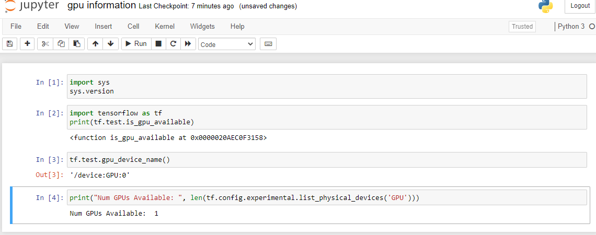

# Getting Started 
#### Creating VirtualEnv (windows)


###### open command panel


```commandline
mkdir "C:\venvs"
cd ../../
cd:\venvs


virtualenv ml_venv -p C:\Users\{Your Username}\AppData\Local\Programs\Python\Python36\python.exe

cd ml_venv
Scripts\activate

without gpu:
    pip install jupyter notebook tensorflow==1.4 keras --use-feature=2020-resolver

with gpu:
    pip install jupyter notebook tensorflow-gpu==2.0 keras
```

### Check point
#### 1.gpu

##### 2. Jupyter 

