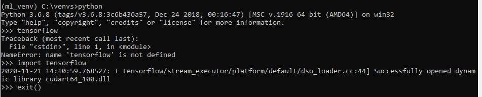

# Getting Started 
#### Creating VirtualEnv (windows)


###### open command panel


```commandline
mkdir "C:\venvs"
cd ../../
cd:\venvs

virtualenv ml_venv -p C:\Users\User\AppData\Local\Programs\Python\Python36\python.exe
pip install jupyter notebook
pip install tensorflow-gpu==2.0
pip install keras
```

### Check point
